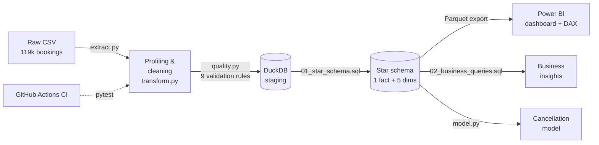
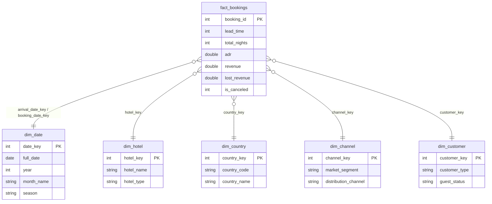
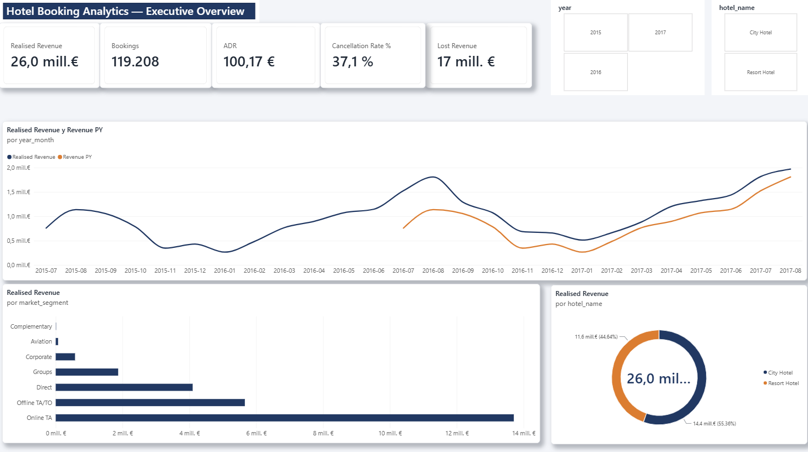
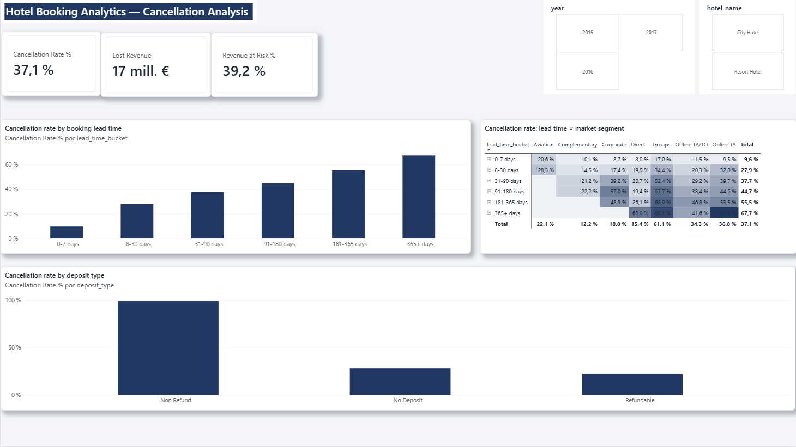
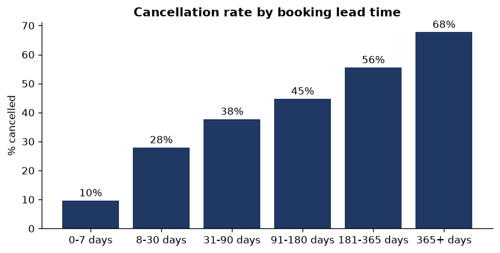
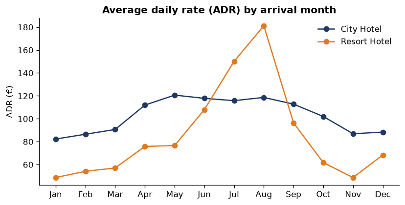
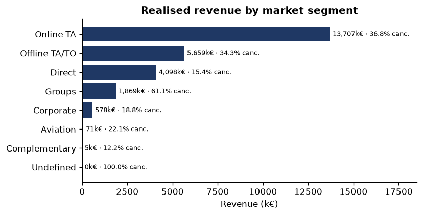
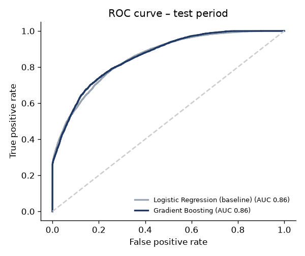

# Hotel Booking Analytics — End-to-End Data Pipeline, BI Dashboard & Cancellation Model


  

End-to-end analytics project on **119,000 real hotel bookings** (a city hotel and a resort
hotel, 2015–2017). It covers the full data lifecycle: **ETL pipeline with data quality
validation → star-schema data model in SQL → business analysis → Power BI dashboard →
machine learning model that predicts cancellations**.

**Business question:** *Cancellations cost these hotels €16.7M in lost revenue (37% of bookings).
Which bookings are likely to cancel, why, and what can revenue management do about it?*

---

## Key findings

| # | Insight | Recommendation |
|---|---|---|
| 1 | **37% of bookings are cancelled**, worth **€16.7M** vs €26.0M of realised revenue. The City Hotel cancels 42% vs 28% for the Resort. | Treat cancellations as the #1 revenue lever. |
| 2 | Cancellation risk grows with booking lead time: **10%** for bookings made within a week vs **68%** for bookings made more than a year ahead. | Stricter conditions or reconfirmation for long lead-time bookings. |
| 3 | **Non-refundable** bookings show a **99% cancellation rate** (mostly large domestic group/agency blocks). | Audit the non-refund policy with travel agencies; it is not protecting revenue. |
| 4 | **Online travel agencies** bring 47% of bookings and the most revenue (€13.7M) but cancel 37%; **direct** bookings have the same ADR (€114) with only **15%** cancellations. | Shift demand to the direct channel (loyalty perks, best-price guarantee). |
| 5 | Guests who make **special requests** or are **repeat guests** cancel far less (17–22% and 15%). | Engagement signals feed the risk model and pre-arrival campaigns. |
| 6 | The **Resort's ADR triples** in August (€181) vs January (€49); the City hotel is flat (€82–121). | Dynamic pricing strategies must differ by hotel type. |
| 7 | The model flags, **before arrival**, the bookings behind **58% of the revenue later lost** to cancellations (ROC AUC 0.86 on unseen months). | Use the risk score for controlled overbooking and targeted reminders. |

---

## Architecture



| Layer | What it does | Files |
|---|---|---|
| **Extract** | Downloads the source file (idempotent) and reads it | `src/extract.py` |
| **Transform** | Imputes missing values, removes invalid records (zero guests, negative / extreme ADR), derives features (arrival & booking dates, nights, revenue, lost revenue, lead-time buckets, seasons) | `src/transform.py` |
| **Data quality** | Profiles the raw data (nulls, duplicates, IQR outliers) and validates 9 business rules; the pipeline **stops** if any rule fails. Generates [`docs/data_quality_report.md`](docs/data_quality_report.md) | `src/quality.py` |
| **Load / Model** | Builds a **star schema** in DuckDB, checks referential integrity (0 orphan keys) and exports Parquet for Power BI | `src/load.py`, `sql/01_star_schema.sql` |
| **Analysis** | 9 business SQL queries (window functions, `RANK`, `LAG` for YoY, Pareto) → [`docs/business_insights.md`](docs/business_insights.md) | `sql/02_business_queries.sql`, `src/analysis.py` |
| **ML** | Logistic regression (baseline) vs gradient boosting, time-based validation → [`docs/model_report.md`](docs/model_report.md) | `src/model.py` |
| **BI** | Power BI report on the star schema with DAX measures (time intelligence, inactive relationships) | `dashboard/` |
| **CI** | Unit tests for cleaning, validation, schema integrity and SQL run on every push | `tests/`, `.github/workflows/ci.yml` |

### Star schema



---

## Dashboard (Power BI)

| Executive overview | Cancellation analysis |
|---|---|
|  |  |

2-page Power BI report built on the star schema (Parquet), with a custom theme
([`dashboard/hotel_theme.json`](dashboard/hotel_theme.json)). Full report:
[`PDF`](dashboard/hotel_booking_analytics.pdf) · [`.pbix`](dashboard/hotel_booking_analytics.pbix).
DAX measures: [`dashboard/measures.dax`](dashboard/measures.dax) — including `Revenue YoY %`
(`SAMEPERIODLASTYEAR`), `Revenue at Risk %` and `Bookings by Booking Date`
(`USERELATIONSHIP` on an inactive relationship).

## Analysis highlights

| Cancellations vs lead time | ADR seasonality |
|---|---|
|  |  |

| Revenue by segment | Model ROC curve |
|---|---|
|  |  |

## Cancellation model

| Model | ROC AUC | Precision | Recall | F1 |
|---|---:|---:|---:|---:|
| Logistic Regression (baseline) | 0.856 | 0.786 | 0.575 | 0.664 |
| **Gradient Boosting** | **0.858** | **0.786** | **0.614** | **0.689** |

- **Time-based validation:** trained on arrivals up to Feb 2017, tested on Mar–Aug 2017
  (as it would run in production), instead of a random split.
- **No data leakage:** only information known at booking time is used
  (`reservation_status`, `assigned_room_type` and `booking_changes` are excluded).
- **Main drivers** (logistic regression): no parking request, non-refundable deposit,
  previous cancellations, domestic market and online travel agencies.

---

## How to run

```bash
git clone https://github.com/alvarolorenzoa/hotel-booking-analytics.git
cd hotel-booking-analytics
python -m venv .venv && source .venv/bin/activate
pip install -r requirements.txt

bash run_all.sh          # pipeline -> SQL analysis -> model -> tests  (~20 s)
```

Outputs: `data/processed/*.parquet` (Power BI source) and the reports/charts in `docs/`.

## Project structure

```
├── src/
│   ├── config.py        # paths, source URL, data quality thresholds
│   ├── extract.py       # E: download + read
│   ├── transform.py     # T: cleaning + feature engineering
│   ├── quality.py       # profiling + validation rules + report
│   ├── load.py          # L: DuckDB star schema + integrity checks + Parquet export
│   ├── pipeline.py      # orchestrates the ETL
│   ├── analysis.py      # runs business SQL, writes insights + charts
│   └── model.py         # cancellation prediction
├── sql/                 # star schema DDL + business queries
├── dashboard/           # Power BI report + DAX measures
├── docs/                # auto-generated reports and charts
├── tests/               # pytest suite (runs in CI on a small fixture)
└── .github/workflows/   # GitHub Actions CI
```

## Tech stack

Python (pandas, scikit-learn, matplotlib) · SQL (DuckDB) · Power BI (DAX, star schema) ·
Parquet · pytest · Git/GitHub Actions

## Data source

Antonio, N., de Almeida, A., & Nunes, L. (2019). *Hotel booking demand datasets.*
Data in Brief, 22, 41–49. https://doi.org/10.1016/j.dib.2018.11.126 (CC BY 4.0).
Figures are in euros; hotel names are anonymised in the source.

---

**Álvaro Lorenzo Antón** · Computer Engineering + Business Administration @ UC3M ·
[LinkedIn](https://www.linkedin.com/in/alvaro-lorenzo-anton-466574291)
