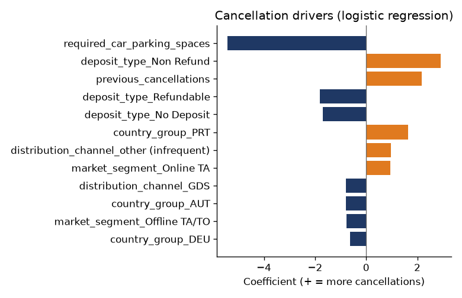

# Cancellation Model Report

_Generated automatically by `src/model.py`._

- Time-based split: train on arrivals before **2017-03-01** (86,430 bookings), test on arrivals from that date (32,778).
- Only features known at booking time are used (no data leakage).

| Model | ROC AUC | Accuracy | Precision | Recall | F1 |
|---|---:|---:|---:|---:|---:|
| Logistic Regression (baseline) | 0.856 | 0.767 | 0.786 | 0.575 | 0.664 |
| Gradient Boosting | 0.859 | 0.779 | 0.785 | 0.617 | 0.691 |

## Business impact

In the test period 40.0% of bookings were cancelled, worth **6,498,976 €**. The Gradient Boosting flags as high-risk the bookings behind **57.8%** of that lost revenue (3,753,208 €), so revenue management can act before the stay (deposit policy, reminders, controlled overbooking).

## Main cancellation drivers (logistic regression)

Odds ratio > 1 increases the probability of cancellation; < 1 reduces it. Numeric features are standardized (effect of +1 standard deviation).

| Feature | Coefficient | Odds ratio |
|---|---:|---:|
| required_car_parking_spaces | -5.418 | < 0.01 |
| deposit_type_Non Refund | 2.913 | 18.42 |
| previous_cancellations | 2.172 | 8.77 |
| deposit_type_Refundable | -1.814 | 0.16 |
| deposit_type_No Deposit | -1.698 | 0.18 |
| country_group_PRT | 1.643 | 5.17 |
| distribution_channel_other (infrequent) | 0.975 | 2.65 |
| market_segment_Online TA | 0.942 | 2.56 |
| distribution_channel_GDS | -0.802 | 0.45 |
| country_group_AUT | -0.782 | 0.46 |
| market_segment_Offline TA/TO | -0.761 | 0.47 |
| country_group_DEU | -0.637 | 0.53 |

